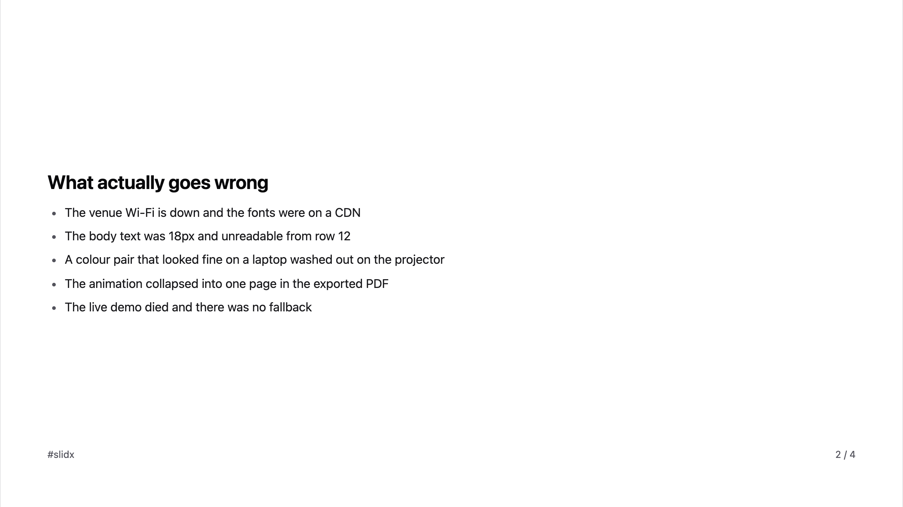
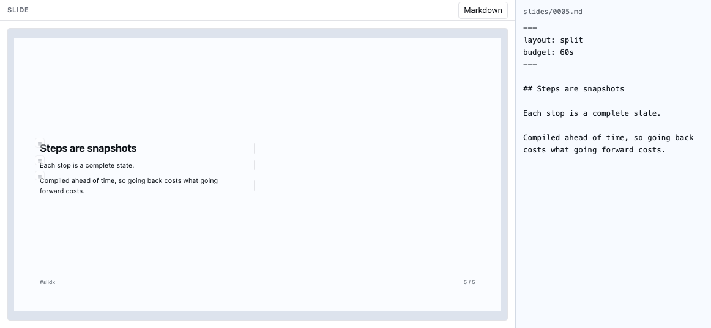
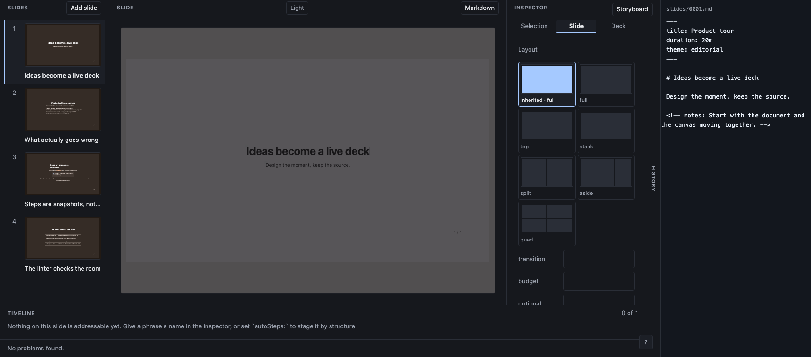
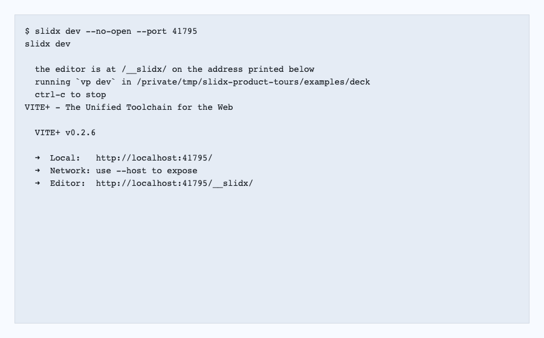

<p align="center">
  <picture>
    <source media="(prefers-color-scheme: dark)" srcset="./assets/brand/lockup-dark.svg">
    
  </picture><br>
  <em>Slide + DX — the whole life of a talk, not just the slides</em>
</p>

<p align="center">
  Markdown decks that compile to static HTML pages. A Rust pipeline, a visual<br>
  editor over the same file, one URL per slide, and no framework in the output.
</p>

---

> [!NOTE]
> An independent personal project by [ubugeeei](https://github.com/ubugeeei), built on the
> [Ox Content](https://github.com/ubugeeei-prod/ox-content) Markdown engine. Pre-alpha and
> **unreleased** — nothing is on npm or crates.io yet.

Making the slides is the short part. The 18px body text nobody could read from
row 12, the colour pair the projector washed out, the fonts on a CDN behind
venue Wi-Fi, the demo that died, the publishing that never happened because you
were exhausted — none of that happens in the editor. slidx treats it as
build-time and runtime work of the framework.

## Start

```bash
vp add -D @slidxjs/vite-plugin
```

```ts
// vite.config.ts
import { defineConfig } from "vite";
import { slidx } from "@slidxjs/vite-plugin";

export default defineConfig({ plugins: [slidx()] });
```

That is the whole configuration.

```bash
vp dev     # the deck, plus the visual editor at /__slidx/
vp build   # one HTML document per slide, asking nothing of any other origin
```

## A deck

```md
---
title: Making Decks Fast
duration: 20m
theme: editorial
layout: aside
---

# Making Decks Fast

{.side}


The result was [3.2x faster]{#result .accent}.
Latency dropped to [120ms]{#latency}[38ms]{#latency}.

<!-- notes: Open with the outcome, not the agenda. -->
```

- **`[text]{#key .class}`** names a range, so the editor has somewhere to point
  when you colour three words.
- **Two marks sharing a key** compile to _one_ element with successive states —
  `120ms` becomes `38ms` in place, rather than two elements that swap.
- **`{.side}` on its own line** puts the block under it in the layout's `side`
  region: a placement a reviewer can read, that still works at 4:3.

Each stop is a complete compiled snapshot, so advancing, going back, `?step=7`
and printing all index into the same vector and cannot drift apart.

<picture>
  <source media="(prefers-color-scheme: dark)" srcset="./docs/images/2-dark.png">
  
</picture>

Emitted by `vp build` from [examples/deck](./examples/deck), whose entire
configuration is `plugins: [slidx()]`. `node scripts/screenshot.mjs` regenerates
it, so an image that stopped being true fails to reproduce rather than quietly
misleading.

## The editor

<picture>
  <source media="(prefers-color-scheme: dark)" srcset="./docs/media/editor-arrange-dark.png">
  
</picture>

`vp dev` serves it at `/__slidx/`, over the deck it is already serving. The
canvas is the deck's own page rather than a preview of it, and the file beside
it is the file on disk — so one drag is one operation, one press of undo, and
one line in the diff.

Text is edited where it sits, and a block's width is a share of its region
rather than a length, so a resize still means something at 4:3. Nothing reloads:
the slide is swapped in place, and your caret stays where it was.

<a href="./docs/media/editor-tour.webm">
  
</a>

The full tour above is one real session: visual and Markdown modes; block colour,
eight-handle resize, free movement and guides; image and video drop; layout and
transition; slide creation, duplicate and reorder shortcuts; undo and redo; then
a second editor changing the same source. Click it for the video.
`vp run record:editor` and `vp run record:tour` regenerate both recordings by
performing their gestures again, so a gesture that stopped working fails to
reproduce rather than showing something that no longer happens.

## The CLI

Separate from the plugin, and optional. These are the commands you will type,
in the order a talk needs them.

```text
slidx dev                  # the deck and the editor, from inside the slides directory
slidx fmt                  # normalise what slidx owns, and nothing you wrote
slidx lint                 # every rule the build runs, non-zero on anything blocking
slidx export --target pdf  # browser | pdf | pdf-zip | png | pptx
slidx doctor               # power, clock, fonts, screen capture, mirroring, Do Not Disturb
slidx publish              # all that needs no account, and the payload for what does
```

`slidx self-update` verifies the latest stable release and hands it to the
version manager. Binaries owned by another package manager stay with that
manager; the command names the correct update path instead of shadowing it.

<a href="./docs/media/cli-tour.webm">
  
</a>

The command tour is captured from the real binary under a terminal. Click it for
the video; `vp run media` rebuilds it from fresh command output.

A speaker keeps five decks in five repositories, so slidx indexes them:

```text
slidx list                 # every deck this machine has seen
slidx grep "venue wifi"    # searches them all, and answers in slides
slidx cd vueconf           # with `slidx shell` loaded, takes you there
```

## What is actually different

|                                                                                                 |
| ----------------------------------------------------------------------------------------------- |
| **Nothing from another origin.** Measured in three browser engines, not written down as advice. |
| **No framework in the output.** Vue, React, Svelte, Solid and Angular opt in per deck.          |
| **MDX is opt-in.** `.md` stays plain; `.mdx` components keep a static Markdown fallback.        |
| **An edit is a byte-range splice.** Your blank lines and `*` bullets survive untouched.         |
| **The linter checks the room.** Projector washout; angular size from the back row.              |
| **One model, one execution.** Editor, projector, PDF and card share one parser.                 |
| **Native speed.** 500 slides in 133 ms — `node scripts/bench-build.mjs` reproduces it.          |

## More

**[Documentation](./docs)** — a walkthrough that ends with a deck you built, a
page for deciding, and one indexed by symptom for the night before you speak.

**[ROADMAP.md](./ROADMAP.md)** — every unchecked line says _why_, and it opens
with what a checked box is allowed to mean. This project has found five features
that were built, tested, merged, and reachable by nobody; that section is the
result.

**[CONTRIBUTING.md](./CONTRIBUTING.md)** — test-first, and `vp run workspace:ci`
is exactly what CI runs.

## License

MIT
