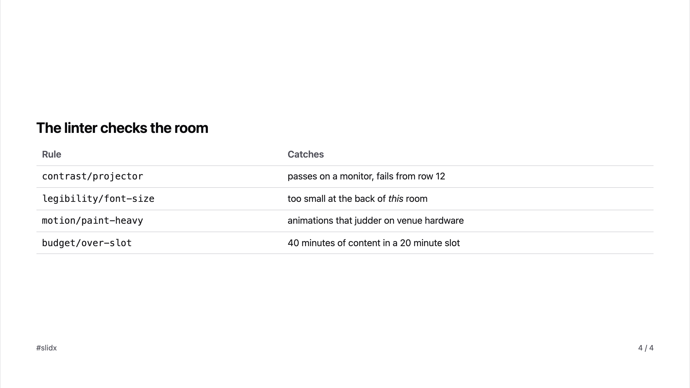

<p align="center">
  <strong>slidx</strong><br>
  <em>Slide + DX — the whole life of a talk, not just the slides</em>
</p>

<p align="center">
  Markdown decks that compile to static HTML pages, a visual editor over the<br>
  same file, and a Rust pipeline underneath. One URL per slide, no client router.
</p>

---

> [!NOTE]
> slidx is an independent personal project by [ubugeeei](https://github.com/ubugeeei), built on
> the [Ox Content](https://github.com/ubugeeei-prod/ox-content) Markdown engine.
> It is pre-alpha and **unreleased** — everything marked shipped below is built
> and tested, and nothing is on npm or crates.io yet.

## Why this exists

**Making the slides is the short part.** Giving the talk is the long one, and
almost everything that goes wrong happens outside the editor:

|                                            |                                            |
| ------------------------------------------ | ------------------------------------------ |
| the venue Wi-Fi is down                    | and the deck's fonts were on a CDN         |
| the body text was 18px                     | and unreadable from row 12                 |
| the projector washed out a colour pair     | that looked fine on a laptop               |
| the build collapsed into one page          | and the animation is gone from the PDF     |
| presenter view refused to open             | because the venue forced display mirroring |
| the demo died                              | and there was no fallback                  |
| the code on screen was unreadable          | and nobody could take it away              |
| publishing afterwards was six manual steps | done exhausted, so it never happened       |

Every one of those is a **build-time or runtime concern of the framework**, not
something a speaker should be handling ten minutes before they walk on. That is
the whole thesis: a presentation tool should know what a conference room does to
a slide, and what a speaker needs between walking up and sitting down.

And a speaker does not give one talk. They keep five decks in five
repositories, revisit one a year later, and reuse a third — so slidx keeps an
index of the decks on your machine rather than assuming the one in front of you
is the only one.

## Start here

```bash
vp add -D @slidx/vite-plugin
```

```ts
// vite.config.ts
import { defineConfig } from "vite";
import { slidx } from "@slidx/vite-plugin";

export default defineConfig({ plugins: [slidx()] });
```

That is the whole configuration. `slidx()` finds `./slides`, serves the deck and
the visual editor in dev, and on build emits static HTML, a PDF, and social
cards.

```bash
vp dev     # the deck, plus the editor at /__slidx/
vp build   # one HTML document per slide, and nothing that needs a network
```

The binary is separate and optional — it does the things a build cannot:

```bash
curl -fsSL https://raw.githubusercontent.com/ubugeeei-prod/slidx/main/install.sh | sh
```

```bash
npm i -g slidx
```

## What you get

### Writing

**Markdown, and a visual editor over the same file.** Not import and export —
two views of one document. Colour three words, drag a block, add an animation:
the diff is a line a reviewer can read, and editing that line by hand moves the
canvas. An edit is a **byte-range splice into the file you saved**, so your
blank lines, your `*` bullets and your hand-wrapped paragraphs survive
untouched. There is a test that drives eight edits through a real repository and
asserts the whole session removed **two** lines.

**A language server for the dialect.** Diagnostics as you type, completion for
frontmatter keys and step presets derived from the Rust enums rather than a
second list, the deck outline as document symbols, and hover that says what a
preset costs.

**A formatter that only touches what slidx owns.** Frontmatter key order and
indentation, the separator's spelling, step marker spelling, the order inside
`{#key .class}` — and never your prose, your line wrapping, your bullet markers,
or anything inside a fence. That boundary is structural rather than
well-intentioned: the formatter emits the same byte-range splice every other
write does, so the bytes it does not name are never read and never rewritten. A
formatter that reflowed a paragraph would produce, deliberately and on every
save, exactly the diff the rest of this pipeline exists to avoid.

**A linter that checks the room, not the monitor.** Contrast through a model of
projector washout. Font size by the angular size a glyph subtends from the back
row. Content overflow measured in a real browser. Images blown up past their own
pixels. Animations that will not stay on the compositor. Time budgets summed
against the slot you were given.

**Themes as tokens.** Four built in — `minimal`, `editorial`, `terminal`,
`contrast` — each holding both light and dark, because the room's lighting is
usually unknown until the day. Every colour is a token and the built-in themes
are held to the linter's own rules, so a theme cannot ship something illegible.

### Building

**No framework in the output.** Nothing is required to view a deck and nothing
is required to write one. A slide that wants Vue, React, Svelte, Angular or
Three.js opts in for itself; the others stay HTML and never pay for it.

**Native speed, Markdown engine included.** The parser, step compiler, linter,
highlighter and renderer are Rust, reached through one WebAssembly module:

| Deck       | Build      | Per slide |
| ---------- | ---------- | --------- |
| 100 slides | **28 ms**  | 0.28 ms   |
| 500 slides | **133 ms** | 0.27 ms   |

`node scripts/bench-build.mjs` reproduces those, so the number in this table is
measured rather than remembered.

**Pages, not an application.** One HTML document per slide. Navigation is the
browser following a link, so a slide can be shared, bookmarked, indexed, opened
on a phone and printed — and it renders before any script runs. A slide with
steps loads one shared module and its own compiled timeline; a slide without
steps loads nothing at all.

**Offline by design.** A built deck makes zero network requests. Fonts, images,
styles and scripts are inlined or bundled, and **a remote asset is a lint
error** — enforced at build time rather than written down as a best practice.

### The room

**A pre-flight check you run where you are standing.** `slidx doctor` reads
power, disk, clock skew against NTP, the fonts your theme names, whether
anything is recording the screen, and whether the network you are on works.
Worst first, each with what to do about it.

**Presentation mode**, holding a wake lock and going fullscreen — and an honest
line about the rest. No web API turns on Do Not Disturb or sets your volume, and
none should: a page that could mute your machine could hide a phishing alert. So
those are a checklist naming the setting and where it lives on your platform.

**Time, as something you can act on.** A clock against the declared slot,
warning before the end rather than as it expires. A behind/ahead reading that
compares where you are against the per-slide budgets you wrote, and names the
slides you marked optional when you need to drop one. Rehearsal recording that
diffs where the time actually went against where you planned it.

**Code you can read, and take away.** A shared fence is highlighted at build
time, published as its own page inside your deck's own output, and a QR on the
slide points at it. The page carries the _whole_ snippet rather than the part
that fitted.

**A demo fallback you declared.** A live target and a recording of it working,
both already in the markup, switched by one key. A fallback that has to be
fetched when the demo dies is not a fallback.

**The audience, when you want them.** An opt-in Cloudflare Worker for moderated
questions and reactions, anonymous by design, and it ends with the talk.

**Your phone as the clicker.** Paired by a QR, with the secret in the URL
fragment so it never reaches an access log — and structurally unable to do
anything but move the deck.

### After, and across talks

**One command from finished deck to published.** `slidx publish` plans every
destination from the frontmatter you already wrote at proposal time, performs
everything that needs no account — the resources page, the blog scaffold, the
archive record — and hands you the payload for the ones that do. Speaker Deck
and Docswell fields are composed and checked against their documented caps.

There is **no HTTP client and no token store** anywhere under it, and that is a
property rather than an omission: a tool that can post as you is a tool that has
to be trusted with a credential.

**The decks you already have.** `~/.slidx` keeps an index that fills itself as
you work, so a talk you gave eighteen months ago is findable without you
remembering which repository it was in. `slidx list` puts them in a table with
the slide count and the slot each one was written for, `slidx grep` searches
every one of them and answers in slides rather than line numbers, and
`slidx cd` resolves a query to the directory. `slidx version` manages several
slidx versions, pinned per deck by a `.slidx-version` file.

**The record that finishes weeks later.** The recording appears when the
conference gets round to it, so the archive step separates _blocked_ — a field
you can add now — from _pending_, a field the world has not produced yet. Add
one line months later and exactly one line of the record changes.

## Status

|                                                           |                                                           |
| --------------------------------------------------------- | --------------------------------------------------------- |
| Framework-independent output                              | **shipped**                                               |
| Native build, Markdown engine included                    | **shipped**                                               |
| Visual editor — outline, canvas, inspector                | **shipped**; animation timeline to do                     |
| Language server — diagnostics, completion, symbols, hover | **shipped**                                               |
| Linter for legibility, overflow, timing                   | **shipped**                                               |
| Built-in themes                                           | **shipped**                                               |
| Code sharing with QR                                      | **shipped**                                               |
| Real-time audience channel                                | **shipped**                                               |
| Timing and rehearsal                                      | **shipped**                                               |
| CLI — doctor, lint, fmt, dev, publish, preview, version   | **shipped**                                               |
| Managed multi-deck index — list, grep, cd, open           | **shipped**                                               |
| Deploy assistance for slide platforms                     | **shipped** (payloads; uploads stay yours)                |
| Formatter for the parts slidx owns                        | **shipped**; dialect type check to do — #82               |
| Custom themes distributable on npm                        | not started — #3                                          |
| SEO artefacts beyond OG and one URL per slide             | not started — #83                                         |
| Automatic translation                                     | not started — #84                                         |
| Speaker camera embed                                      | not started — #85                                         |
| System-level control of notifications and volume          | **will not ship** — no browser API, and none should exist |

Nothing above is released yet. [ROADMAP.md](./ROADMAP.md) is the honest version:
every unchecked line there says _why_ it is not done, and it opens with what a
checked box is allowed to mean — a distinction this project learned the hard
way.

## What it looks like

Emitted by `vp build` in [examples/deck](./examples/deck), whose entire
configuration is `plugins: [slidx()]`. `node scripts/screenshot.mjs`
regenerates these, so an image that stopped being true fails to reproduce rather
than quietly misleading.

<picture>
  <source media="(prefers-color-scheme: dark)" srcset="./docs/images/2-dark.png">
  
</picture>

<picture>
  <source media="(prefers-color-scheme: dark)" srcset="./docs/images/4-dark.png">
  
</picture>

### The speaker's view

Ordered by how urgently a question needs answering mid-sentence, not by how much
space the answer needs. The clock is the largest thing on the page; the notes get
more room than the slide, because the slide is already on the wall behind you and
what you cannot see is what you meant to say about it.

<picture>
  <source media="(prefers-color-scheme: dark)" srcset="./docs/images/2-presenter-dark.png">
  
</picture>

Arrow keys drive the deck from here, because that is where a clicker sends them.
A second window stays on the same slide over a broadcast channel; where that
channel is unavailable, mirroring is off and the deck still presents.

## The shape of a deck

```md
---
title: Making Decks Fast
event: SlidxConf 2026
duration: 20m
theme: editorial
aspect: "16:9"
---

# Making Decks Fast

<!-- notes:
Open with the outcome, not the agenda.
-->

---

autoSteps: list
budget: 90s
---

## What we will cover

- Why the parser matters
- What the linter catches
- How publishing collapses into one command
```

Each `<!-- step -->`, `autoSteps:` mode, or explicit `steps:` list compiles into
the same timeline, so the animation you author is the animation that prints.

### Addressing part of a line

A _mark_ names a range inside a block — the smallest thing an editor can point
at, and the reason selecting three words and colouring them has somewhere to go
in the file:

```md
The result was [3.2x faster]{#result .accent}.
```

### Changing something already on screen

Revealing covers "not there yet". For a value that _changes_, write the takes
next to each other and they become one element with successive states:

```md
Latency dropped to [120ms]{#latency}[38ms]{#latency}.
```

One DOM node whose text changes, not two that swap. Stepping backwards shows the
earlier value again, because each stop is a complete snapshot and the runtime
keeps no history.

For properties rather than content, say so in the timeline:

```md
---
steps:
  - set: { target: "#latency", color: success }
---
```

### Sharing a fence

```rust {#retry-policy .share title="How we back off"}
fn retry(attempt: u32) -> Duration { … }
```

`.share` publishes the snippet as its own page in the deck's output and draws a
QR on the slide pointing at it.

## Principles

**One model, one execution.** The editor, the projector, the presenter view, the
PDF and the social card all consume the same parsed deck. Presentation tools
fail when those quietly disagree; the only durable fix is one parser and one step
engine. That is also why the bindings are WebAssembly rather than a native
addon — the editor's live preview and the production build run _the same code_.

**Steps are snapshots, not deltas.** Each stop is a _complete_ state, compiled
ahead of time. Advancing, going back, deep-linking to `?step=7` and printing all
index into the same vector, so they cannot drift.

**Parsing never fails.** Decks get edited minutes before a talk. A bad line
produces a diagnostic and a slide that still renders, never an error that leaves
a speaker with nothing.

**Say what to do.** Every diagnostic carries a code, a position, and a concrete
next action. A warning you cannot act on is noise.

**Never claim more than you have.** Where a browser cannot do something, slidx
says so and names the setting instead of pretending. A tool that reported a
working fallback and then showed a spinner would be worse than no fallback,
because you would have stopped checking.

## The `slidx` command

Three jobs, and none of them is building a deck. **Writing** one, when you would
rather not leave the terminal. **The room** — what is about to happen to your
talk that no editor can see. And **the decks you already have**, because a
speaker who gives four talks a year has four repositories and remembers where
none of them are.

```bash
slidx dev         # write the deck, with the editor open
slidx fmt         # normalise the parts slidx owns, and nothing else
slidx tui         # step through a deck's structure in the terminal
```

```bash
slidx doctor      # check the machine you are about to speak from
slidx lint        # every rule the build runs, exiting non-zero on anything blocking
slidx preview     # open the built PDF, or --web to serve the deck on loopback
slidx publish     # plan, and perform the half that needs no account
```

```bash
slidx list        # every deck this machine has seen: slides, slot, event, when
slidx grep        # search them all, and get back the slide rather than the line
slidx cd          # print a deck's directory, for a shell function to enter
slidx open        # fuzzy-find a deck and print its path
slidx version     # install and switch between slidx versions
```

`slidx grep` is the one worth explaining. `slides/0007.md:12` is not where a
speaker keeps their content — "slide 7 of the VueConf deck" is — so the search
parses what it matches and answers in slides. It reads decks and not
repositories: `node_modules`, build output and dot directories are skipped, and
a deck is parsed only once a line in it has already matched, which is what makes
it fast enough to type on a whim.

`slidx cd` prints a path rather than changing directory, and that is not a
limitation waiting to be fixed: **a child process cannot change the working
directory of the shell that started it.** So it resolves, and a shell function
enters — the same pair every directory jumper is built out of.

Either install channel hands over the same prebuilt binary — no Node, no
compiler, and **no `postinstall` that downloads anything**. The shell installer
verifies the download against the SHA-256 published with the release and never
asks for sudo; `--dry-run` prints where it would put the binary and stops.

It installs into `$SLIDX_HOME`, else `$XDG_DATA_HOME/slidx`, else `~/.slidx` —
and `%LOCALAPPDATA%\slidx` on Windows. `slidx version` resolves the same path in
the same order, which is what lets the version manager ever be in charge of the
binary you are running.

### In your shell

```bash
slidx completions <shell>   # what `slidx <tab>` offers
slidx shell <shell>         # the function that lets slidx move you
```

Both are generated from the one table the parser reads, so what completes is
what runs. Run either with no argument and it lists the shells it knows and
which file the output belongs in — the list is not repeated in this README,
because a list in prose is a list that goes stale.

Two of those shells are honest special cases. **sh** has no programmable
completion and no script will ever give it one, so it is told so in a sentence
rather than handed a stub that installs cleanly and changes nothing. **ush**
completes from a catalogue compiled into itself, so what slidx writes is that
catalogue entry, in ush's own shape, for its maintainer to adopt.

The integration is the other half, and every shell has it: a process cannot
change its parent's working directory, so a command that finds a deck can only
print where it is. One shell function closes that gap, and it is derived from
the table too — a command that needs your shell gets it in every shell at once.

Prebuilt for macOS on Apple silicon and Intel, Linux on x86-64 and ARM64
(statically linked, so Alpine works), and Windows on x86-64. Anywhere else,
`cargo install slidx_cli` builds it.

`dev` and `preview` are easy to confuse and answer different questions. `dev`
serves your slide files live with the editor at `/__slidx/` and can write to
them; `preview` serves what the build already produced and never writes
anything. One shows you the deck you are writing, the other shows you what the
projector will show.

**There is deliberately no `slidx build`.** That is `@slidx/vite-plugin`'s job,
and one pipeline is the whole point. `slidx dev` is not the exception it looks
like: it implements no server. It finds your Vite config by walking up from the
deck, works out which package manager filled `node_modules` by reading the
lockfile, hands the terminal to `vite dev` with the plugin, and gets out of the
way. Every byte of HTML still comes from one place.

## Development

[Vite+](https://voidzero.dev) runs every task in this repository, Rust and
TypeScript alike. One command runs exactly what CI runs:

```bash
vp run workspace:ci
```

See [CONTRIBUTING.md](./CONTRIBUTING.md) for the method and the layout rules,
and [RELEASING.md](./RELEASING.md) for how a release is cut.

## License

MIT
