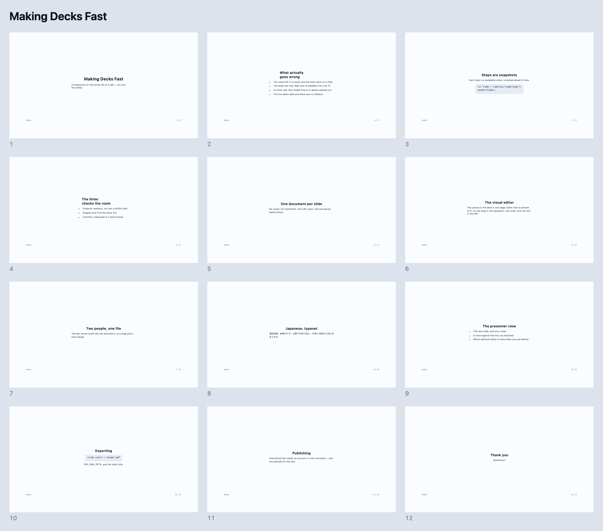
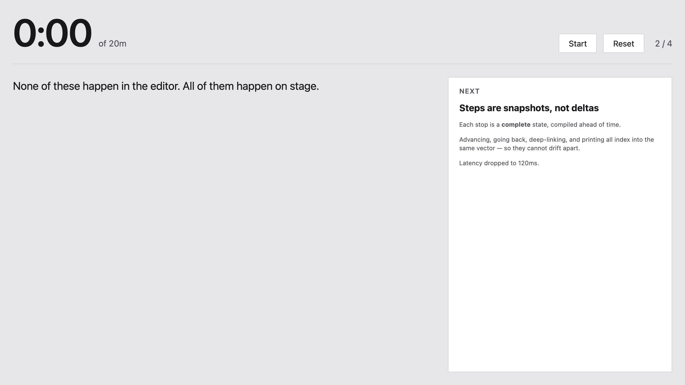
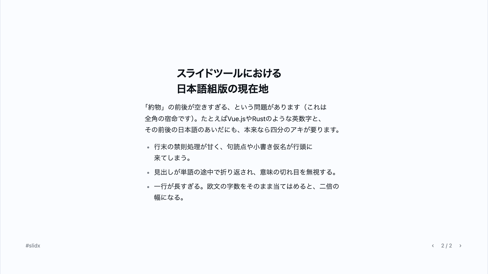

<p align="center">
  <picture>
    <source media="(prefers-color-scheme: dark)" srcset="./assets/brand/lockup-dark.svg">
    
  </picture><br>
  <em>Slide + DX — the whole life of a talk, not just the slides</em>
</p>

<p align="center">
  <strong>Write Markdown. Get a real website.</strong><br>
  A visual editor over the same file, a CLI that knows every deck on your<br>
  machine, and static HTML that asks nothing of any other origin.
</p>

---

> [!NOTE]
> An independent personal project by [ubugeeei](https://github.com/ubugeeei), built on the
> [Ox Content](https://github.com/ubugeeei-prod/ox-content) Markdown engine. Pre-alpha and
> **unreleased** — nothing is on npm or crates.io yet.

## Why

A deck is a document. It should be a file you can diff, a site you can link
into, and a thing you can still present when the venue Wi-Fi is gone.

So slidx compiles Markdown to **one static HTML page per slide** — no router, no
framework in the output, nothing fetched from another origin. Everything else
falls out of that one decision. A slide has a URL, so it can be shared,
bookmarked, crawled and printed. The words are in the markup, so a search engine
and a screen reader both get them. There is no runtime to boot, so it renders
before anything runs.

And because the source is Markdown, the visual editor and the file on disk are
**the same thing** — not an import, not an export.

## Sixty seconds

```bash
vp add -D @slidxjs/vite-plugin
```

```ts
// vite.config.ts
import { defineConfig } from "vite";
import { slidx } from "@slidxjs/vite-plugin";

export default defineConfig({ plugins: [slidx()] });
```

That is the whole configuration.

```bash
vp dev     # the deck, plus the visual editor at /__slidx/
vp build   # one HTML document per slide
```

Write `slides/0001.md` and it is on screen. Nothing to scaffold, nothing to
configure first — or start from a deck that already builds and lints clean with
[`slidx create`](#making-one).

## Write Markdown

```md
---
title: Making Decks Fast
duration: 20m
theme: editorial
layout: aside
---

# Making Decks Fast

{.side}


The result was [3.2x faster]{#result .accent}.
Latency dropped to [120ms]{#latency}[38ms]{#latency}.

<!-- notes: Open with the outcome, not the agenda. -->
```

<picture>
  <source media="(prefers-color-scheme: dark)" srcset="./docs/images/2-dark.png">
  
</picture>

Four built-in themes, six layouts, and animation steps that are **complete
compiled snapshots** rather than deltas — so advancing, going back, `?step=7`
and printing all index into the same vector and cannot drift apart.

- **`[text]{#key .class}`** names a range, so the editor has somewhere to point
  when you colour three words.
- **Two marks sharing a key** compile to _one_ element with successive states —
  `120ms` becomes `38ms` in place, rather than two elements that swap.
- **`{.side}` on its own line** puts the block under it in the layout's `side`
  region: a placement a reviewer can read, that still works at 4:3.

Emitted by `vp build` from [examples/deck](./examples/deck), whose entire
configuration is `plugins: [slidx()]`. `node scripts/screenshot.mjs` regenerates
the picture, so an image that stopped being true fails to reproduce rather than
quietly misleading.

## …or don't

<picture>
  <source media="(prefers-color-scheme: dark)" srcset="./docs/media/editor-arrange-dark.png">
  
</picture>

`vp dev` serves a full visual editor at `/__slidx/`, over the deck it is already
serving. **The canvas is the deck's own page**, not a preview of it, and the file
beside it is the file on disk — so one drag is one operation, one press of undo,
and one line in the diff.

|                         |                                                                                |
| ----------------------- | ------------------------------------------------------------------------------ |
| **Direct manipulation** | Drag a block between regions with guides, resize on eight handles, move freely |
| **Edit in place**       | Text is edited where it sits; nothing reloads and the caret stays put          |
| **Inspector**           | Selection, Slide and Deck tabs — font, size, colour, layout, transition        |
| **Live previews**       | Every slide in the left panel as a real rendering, not a title                 |
| **Animation timeline**  | Rows are what a slide addresses, columns its stops, and the playhead scrubs    |
| **Storyboard**          | The whole talk against the clock, with the optional slides drawn as slack      |
| **Live diagnostics**    | The linter, inline, while you are still dragging                               |

An edit is a **byte-range splice into the file you saved** — never a
re-serialisation. Your blank lines, your `*` bullets and your hand-wrapped
paragraphs survive untouched. That is held by a test which drives a real dev
server against a real git repository through eight edits and asserts on
`git diff`: four files touched, **two** removed lines in the whole session, and
not one of them a line the author typed by hand.

<a href="./docs/media/editor-tour.webm">
  
</a>

The tour above is one real session — click it for the video. `vp run
record:editor` and `vp run record:tour` regenerate both recordings by performing
their gestures again, so a gesture that stopped working fails to reproduce
rather than showing something that no longer happens.

### Two people, one file

`slidx dev --crdt` prints a link and a QR code for the laptop next to you. It is
**read only**; `--allow-edit` mints a second link, and only that one can change
the deck. The dev server holds the one document, so a drag on their canvas and a
file you saved in your own text editor merge rather than overwrite.

The roster says who is here. The canvas says **where** — a mark on the block each
person has selected, with their name on it. Press a name to move with them.

No account, no sign-in, no hosted anything. The share secret travels in the URL
fragment, which is never sent with a request, so it reaches no access log, no
referrer header and no proxy.

## The CLI

Separate from the plugin, and optional.

### Making one

```text
slidx create ~/talks/vueconf --title "Making Decks Fast" --duration 20m
slidx add --title "What actually goes wrong"
slidx save
```

`create` writes four files and nothing to fill in — a deck that parses and lints
clean, a one-line Vite config, a package.json and a `.gitignore`. A test parses
that deck and runs the linter over it, so a template that stopped being clean
fails there rather than on somebody's first run.

`add` splices through the same edit crate the visual editor uses, because a
second writer of deck Markdown is the one thing the architecture is arranged to
prevent. And `save` has a parser where `git commit` has none, so the message
says _two slides added, the demo retimed, notes written on the opening_ rather
than `+34 −6`.

### Giving it

```text
slidx dev                     # the deck and the editor
slidx fmt                     # normalise what slidx owns, and nothing you wrote
slidx lint                    # every rule the build runs
slidx export --target pdf     # browser | pdf | pdf-zip | png | pptx
slidx doctor                  # power, clock, fonts, capture, mirroring, Do Not Disturb
slidx publish                 # all that needs no account, and the payload for what does
```

<a href="./docs/media/cli-tour.webm">
  
</a>

Captured from the real binary under a terminal — click it for the video.
`vp run media` rebuilds it from fresh command output.

### It finds the deck you forgot

You keep five decks in five repositories and cannot remember which one had the
slide about retries.

```text
slidx list                    # every deck this machine has seen
slidx grep "venue wifi"       # searches them all, and answers in slides
slidx open vueconf            # fuzzy-find and open
slidx cd vueconf              # with `slidx shell` loaded, takes you there
slidx mv vueconf vue-fes      # rename, followed everywhere it is written down
slidx rm oldtalk              # archived under the slidx home, not destroyed
```

`grep` reports **the slide a match is on**, not a line of a file — because
`slides/0007.md:12` is an address a speaker cannot use and "slide 7 of the
VueConf deck" is one they can. It reads only decks, stops at `node_modules` and
build output, and parses a deck only once something in it has already matched.

`rm` **moves** a project into an archive under the slidx home and records where
it came from. A deck is often the only copy of work that took weeks, written at
night, in a repository that has never been pushed.

There is also `slidx lsp` behind the VS Code, Zed and Neovim plugins, `slidx
tui` and `slidx preview` for a terminal, and `slidx mcp` for an agent.

## Give the talk

<picture>
  <source media="(prefers-color-scheme: dark)" srcset="./docs/media/overview-dark.png">
  
</picture>

`/overview/` is every slide at once, each a link to itself — the real slides
drawn small rather than pictures of them, on a page that **runs nothing at
all**, because a slide is already a size container and putting one in a small
box is the whole of drawing a thumbnail. `vp run media:overview` regenerates
the picture from a real deck.

<picture>
  <source media="(prefers-color-scheme: dark)" srcset="./docs/images/2-presenter-dark.png">
  
</picture>

The presenter view is its own URL, so a projector that forces mirroring cannot
take it away. It carries your notes, the next slide, and a clock against the slot
your frontmatter declared. The two windows follow each other in **both**
directions — which matters, because a clicker's keys go to whichever window is
focused, and at a venue that is usually the projector.

- `→` `PageDown` and the rest of what a remote sends, on **every** slide
- `f` takes the whole screen and asks it to stay awake
- **Swipe** on a phone; real `‹ ›` anchors with scripting switched off
- `slidx doctor` reads power, clock skew, fonts, capture and mirroring before you
  walk on

## Ship it

```bash
slidx export --target pdf     # also: browser | pdf-zip | png | pptx
```

The PDF has **one page per animation stop**, so the handout is not a different
talk from the one you gave. PPTX ships a rendered image per stop plus the notes
as real notes text. Export runs the deck's own build and packages what it wrote —
there is no second renderer to disagree with the first.

And because a deck is a website, it arrives with what a website needs:

|                       |                                                                        |
| --------------------- | ---------------------------------------------------------------------- |
| **One URL per slide** | Shareable, bookmarkable, crawlable — and the words are in the markup   |
| **Structured data**   | `PresentationDigitalDocument` JSON-LD, so an archive can read the talk |
| **Social cards**      | An OG image per slide and per deck, drawn at build time                |
| **Sitemap + robots**  | Generated together from one `draft:` flag, so they cannot disagree     |
| **Canonical links**   | …and **nothing absolute at all** until you name the origin             |

That last one is deliberate. A build does not know where it will be deployed, and
a guessed canonical points a search engine at somebody else's host — so until
`url:` says, no canonical, no `og:url`, no sitemap.

`slidx publish` then does everything that needs no account and writes the payload
for what does. There is no HTTP client under it and no token store: a tool that
can post as you is a tool that has to be trusted with a credential.

## Fast, and measured

```text
500 slides                       Rust, release
  parse                  2.13ms
  render                32.29ms
  per slide             64.58µs
```

`vp run bench:rust` reproduces it and prints a breakdown by **what is on a
slide** rather than one total — because a total tells you the render is slow and
nothing about what to do next. `vp run bench:build` measures a whole `vite
build`, and `scripts/budget.mjs` fails CI when the output grows.

An audience slide with no steps **fetches no JavaScript at all**: no module, no
bundle, no request. What it carries inline is a couple of kilobytes of
navigation, itemised in the budget.

## Getting around a deck

`→` and a presentation remote's `PageDown` work on every slide, including the
ones with nothing to reveal — and so does the presenter view, which is usually
where a clicker's keys land. The two windows follow each other in **both**
directions.

Without a keyboard the footer's `‹ n / m ›` is the same navigation: real
anchors between real documents, so a deck opened from a USB stick with
scripting switched off is still a deck you can move through. On a phone, swipe
— every length on a slide is a share of the slide, so those two glyphs measure
about four pixels by three on a 375px screen, which makes the swipe the
navigation there rather than a shortcut for it.

`f` takes the whole screen and asks it to stay awake. `/overview/` is every
slide at once, each a link to itself — the real slides drawn small rather than
pictures of them, on a page that runs nothing at all, because a slide is
already a size container and putting one in a small box is the whole of drawing
a thumbnail.

## A deck written in Japanese

Displaying Japanese and **setting** it are different jobs, and a browser left to
its defaults does the first. 約物 sit in full-width boxes with a hole either
side. Headings break in the middle of a word, because there is no space to break
at and nothing said to look for one.

```md
---
lang: ja
---

## スライドツールにおける日本語組版の現在地
```

<picture>
  <source media="(prefers-color-scheme: dark)" srcset="./docs/media/japanese-dark.png">
  
</picture>

`lang: ja` — or nothing at all, because a deck that declares no language has its
slides read rather than being served as English — switches on 禁則処理, 約物のアキ
trimming, `palt`, a 文節-aware line break, and a leading of its own, because a run
of filled em boxes needs more room than a Latin line does at the same ratio.

[How type is set](./docs/content/typography.md) has the curves, the numbers each
theme resolves to, and which of it every browser does.

## What is actually different

|                                                                                                 |
| ----------------------------------------------------------------------------------------------- |
| **Nothing from another origin.** Measured in three browser engines, not written down as advice. |
| **No framework in the output.** Vue, React, Svelte, Solid and Angular opt in per deck.          |
| **MDX is opt-in.** `.md` stays plain; `.mdx` components keep a static Markdown fallback.        |
| **An edit is a byte-range splice.** Your blank lines and `*` bullets survive untouched.         |
| **The linter checks the room.** Projector washout; angular size from the back row.              |
| **Japanese is typeset, not rendered.** 禁則, 約物, 文節 breaking, and its own leading.          |
| **Navigation without a runtime.** Real links between real documents; a swipe on a phone.        |
| **One model, one execution.** Editor, projector, PDF and card share one parser.                 |

## More

**[Documentation](./docs)** — what it is, sixty seconds, a walkthrough that
ends with a deck you built, a page for deciding, and one indexed by symptom
for the night before you speak.

**[ROADMAP.md](./ROADMAP.md)** — every unchecked line says _why_, and it opens
with what a checked box is allowed to mean. This project keeps finding features
that were built, tested, merged, and reachable by nobody; that section is the
result.

**[CONTRIBUTING.md](./CONTRIBUTING.md)** — test-first, and `vp run workspace:ci`
is exactly what CI runs.

## License

MIT
