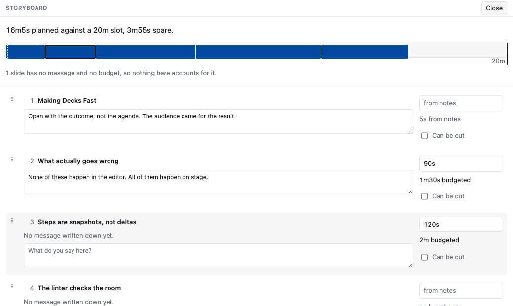

# 前夜

明日発表します。このページは症状ごとの索引で、各項目は何を走らせ、答えが何を意味するかを
言います。ここでは概念を説明しません。

五分あり、まだ何も壊れていないなら、このページの末尾「登壇二十分前」へ飛んでください。

## The build will not finish

パースは失敗しません。悪い行は診断と、それでも描画されるスライドであり、何も残さない
エラーではありません。ビルドを止めるのは **blocking** な診断で、メッセージが規則と
次にすることを名指します。

真夜中で、規則が自分のデッキについて間違っていると決めたなら。

```ts
export default defineConfig({ plugins: [slidx({ failOnDiagnostics: false })] });
```

今夜デッキは手に入ります。規則が警告していたデッキも手に入ります。黙らせる前に診断を
読んでください。

## 会場の Wi-Fi が落ちている

ビルドしたデッキは自分自身以外のどこにも何も求めません。フォント、画像、スタイル、
スクリプトは隣にあり、別オリジンのアセットはビルドエラーです。ビルドできたデッキは、
すでにネットワークを要しないデッキです。自分の画像はそれでも画像として読みますが、
誰か別の人が配るものではありません。

信じるより、いま証明してください。ネットワークを切った状態で、ファイルシステムから
`dist/slides/index.html` を開く。描画されれば、明日の会場はそれを奪えません。

## このマシンが用意できているか分からない

```bash
slidx doctor
```

最悪が先。各所見に次にすることが付きます。電源、ディスク、NTP に対する時計のずれ、
テーマが名指すフォント、画面を録っているもの、いま乗っているネットワークが本当に
動くかを読みます。

<picture>
  <source media="(prefers-color-scheme: dark)" srcset="../../media/terminal-doctor-dark.png">
  
</picture>

これはこのページを生成したマシンからの実報告で、それ以外の種類はありません。コマンドは
立っているノート PC を読みます。

`UNKNOWN` は `PASS` ではありません。移植可能なものがそれを読めないという意味で、
Do Not Disturb がオンかどうかの推測は沈黙より悪いです。

実際に話すマシンで走らせてください。トークを書いたノート PC と発表するノート PC は、
二つの答えです。

## 後ろから文字が小さすぎるかもしれない

```bash
slidx lint
```

規則はピクセルの閾値ではありません。最後列からグリフが張る視角で、答えのある唯一の
問いの形です。ノート PC の 24px と、後ろから三列の壁の 24px は別の大きさです。

## ノート PC では色が問題なかった

同じコマンドです。コントラストは WCAG 比として調べ、それからプロジェクタがそれに
することを通してもう一度調べます。白飛びは、当日、会場で、照明が上がったときだけ
現れる失敗です。

報告が悪く、遅いなら、まさにこのためにあるテーマへ切り替えます。

```yaml
theme: contrast
```

## 何かがスライドの端から落ちている

溢れは実ブラウザで測ります。収まるかは改行位置に依り、ビルド時のモデルはそれを知りません。
報告がきれいではなく **unchecked** なら、ブラウザがありませんでした。反対の答えで、
デッキが大丈夫なのは片方だけです。

```bash
vp exec playwright install chromium
```

## 電話からデッキを進めたい

プレゼンタービューの **Phone** ボタンは、デッキが Worker を名指したときにあります。
QR を読む。秘密は URL フラグメントに留まり、リクエストと一緒には送られません。ボタンが
無いなら、デッキはオプトインしていません。[フォンリモート](remote.md) を見てください。

電話のページは `/slides/remote/` です。ナビゲートしません。リレーが落ちても、演壇の
キーボードはプロジェクタを進めます。

## プレゼンタービューが開かない、またはプロジェクタがミラーリングを強制する

プレゼンタービューは slidx が開くことを許されなければならないウィンドウではなく、
それ自身の URL です。dev では `/slides/presenter/`、ビルドでは `presenter/index.html`。
第二のウィンドウで自分で開いてください。代わりに開くキーはありません。

二つのウィンドウはブロードキャストチャネルで同じスライドに留まります。チャネルが
使えないところではミラーリングはオフで、**デッキはそれでも発表できます**。見ている
ウィンドウを自分で進めます。

## デモが死ぬかもしれない

フォールバックを宣言したスライドは、マークアップに **両方** を載せます。ライブと、
動いている録画です。デモが死んだときに取らなければならないフォールバックは
フォールバックではなく、同じ瞬間に同じ理由で失敗する二個目です。

切り替えは属性の書き込み一つで、**それにバインドされたキーはまだありません**。
ステージ上ではなく今夜知っておく価値があります。デモが死んだら、録画はページの中に
あります。コンソールを開いて figure に `data-slidx-demo="fallback"` を付けてください。

デモのスライドに宣言したフォールバックがなく、一時間あるなら、動いているところを録って
宣言してください。十分ならスクリーンショットです。

## 時間をオーバーしそうだ

プレゼンタービューの時計は、フロントマターが宣言した枠に対して動き、切れるときではなく
その前に知らせます。

スライドごとの読みは **リハーサル報告** で、予測ではなく測定された同じ事実です。
Rehearse を押し、トークをし、「7 枚目に四分かけて予算は一分」と言います。手を打てる
唯一の形です。今夜やってください。話しながら動く遅れ／余裕の表示はありません。

落とせるスライドに、まだ考えられる今夜、印を付けます。

```yaml
optional: true
```

遅れているときに提示されるのはそれだけです。トークが失ってよいものを決めるのは著者で、
何も推測しません。

エディタの **ストーリーボード** でそれをします。時計に対してトーク全体を見せる唯一の
ビューで、一枚ずつのビューではありません。

<picture>
  <source media="(prefers-color-scheme: dark)" srcset="../../media/editor-storyboard-dark.png">
  
</picture>

各スライドは与えた時間の幅で描かれ、デッキが宣言した枠に対して並び、選んだ一枚で
`o` を押すと任意になります。ファイルの一行と、落とすと実際に何が買えるかの一文。
どのスライドのサムネイルも意図的にありません。ここでの問いは何を言っているか、収まるか、
何を切るかで、絵の壁はどれにも答えません。

`vp run record:editor` は、実デッキのストーリーボードを開いてキーを押すことで録画を
再生成します。これを言わなくなったパネルは再現に失敗するので、もう起きないことの写真が
残りません。

## 欲しくて覚えていないキー

| キー                               | すること                                    |
| ---------------------------------- | ------------------------------------------- |
| `→` `↓` `Space` `Enter` `PageDown` | 進む。次の停留、それから次のスライド        |
| `←` `↑` `PageUp` `Backspace`       | 戻る                                        |
| `Home` / `End`                     | 最初 / 最後のスライド                       |
| `Tab` のあと `Enter`               | フッタの `‹` と `›`                         |
| `f`                                | フルスクリーン。画面をつけたままにする      |

これらはプレゼン用リモコンが実際に送るキーで、**すべての** スライドで動きます。
見せるもののない一枚も含みます。つい最近まで、右矢印が何もしないページでした。

プレゼンタービューでも動きます。クリッカーのキーが着くのはたいていそこで、二つの
ウィンドウは両方向に従います。

フッタの `‹ n / m ›` はキーボードなしの同じナビゲーションです。文書のあいだの本物の
リンクなので、USB メモリからでも、スクリプトを切っても動きます。電話では **スワイプ**。
スライド上の長さはすべてスライドの取り分なので、375px の画面ではその二つのグリフは
およそ 4 ピクセルかける 3 で、スワイプがそこでのナビゲーションであり、その短縮では
ありません。

## 六十枚から一枚を見つけたい

```text
/overview/
```

すべてのスライドが一度に。それぞれが自分へのリンクです。写真ではなく、小さく描いた
本物のスライドなので、探しているものは覚えている見た目です。ページは何も走らせません。
スライドはすでにサイズコンテナで、小さい箱に入れることがサムネイルを描く全部だからです。

`f` はウェイクロックも頼み、拒まれても構いません。ロックを持たないブラウザでも画面は
くれます。どちらも _ブラウザが_ 許すものです。Do Not Disturb を切ることはここではできず、
`slidx doctor` がプラットフォーム上の場所を名指します。

**ブラックアウトのキーはまだありません。** ある価値はあり、ありません。トークの前夜に
それを約束したリストは、短いリストより悪いです。

## Somebody is going to ask for the code

`.share` と印したフェンスは、デッキ自身の出力の中の独立したページとして公開され、
スライド上の QR がそれを指します。

````md
```rust {#retry-policy .share title="How we back off"}
fn retry(attempt: u32) -> Duration { … }
```
````

ページはスライドに収まった部分ではなくスニペット全体を運び、スクリプトは載せません。
コピーボタンすらありません。選択はどの電話にもあるブラウザの機能で、そのページは
ホテルの回線で開かれやすい一枚だからです。

## PDF が要る

```bash
slidx export --target pdf
```

印刷文書 — dev では `/slides/print/` — はデッキ全体で、アニメーションの停留ごとに
一ページです。配布物が、したトークと別の話にはなりません。`slidx export` はビルドを
走らせ、書いたものを梱包します。再描画はしません。第二のレンダラは、渡すファイルが
確認したデッキと違うことを意味するからです。

## デッキが見つからない

```bash
slidx list          # このマシンが見たすべてのデッキ
slidx grep "wasm"   # 全部を探し、スライドで返す
slidx open          # あいまい検索し、パスを印字する
```

`slidx grep` はファイルパスではなくスライドで答えます。話し手が内容を置いているのは
「VueConf デッキの 7 枚目」で、`slides/0007.md:12` ではないからです。

## 登壇二十分前

1. このマシン、このネットワーク、電源を繋いで `slidx doctor`。
2. Wi-Fi を切って、ファイルシステムからビルドしたデッキを一度開く。
3. 第二のウィンドウでプレゼンタービューを開き、時計が自分の枠を言っているか見る。
4. `b` を押す。もう一度押す。欲しくて忘れるキーです。
5. デモがあるなら、`d` を一度押してフォールバックを見、もう一度で戻る。

それからリハーサルのノート PC の蓋を閉じて出てください。上のことはすでに決まっています。
