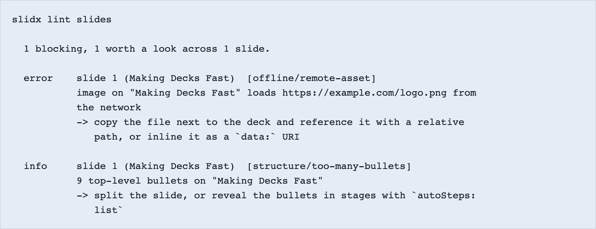

# Build a deck, and present it

What slidx *is* is on [Start](index.md). This page is the path that actually
runs today: a clone, because nothing is on npm yet. At the end of it you will
have a deck you wrote, a linter that caught something you could not have seen,
a presenter view with a clock in it, and a directory of HTML files that open
with the network off.

<video src="../media/deck.webm" controls loop muted playsinline preload="metadata" width="960"></video>

A built deck, driven by the arrow key a presentation remote sends. Every picture
and recording on this site is regenerated by `node scripts/record.mjs` from a
real run, so one that stopped being true fails to reproduce rather than quietly
showing a product that no longer exists.

Two other people read this site. If you are one of them, start there instead:

- You have a talk in a few weeks and are deciding →
  [Choosing slidx for a talk](choosing.md)
- You are speaking tomorrow and something is wrong →
  [The night before](tonight.md)

## Before you spend twenty minutes

slidx is **not on npm or crates.io yet**. `npm i @slidxjs/vite-plugin` installs
nothing today. Until the first release the way to run it is from a clone, which
is what this page does, and the commands here are the ones this repository's own
CI runs — so they work, and they are not the two-line install that will replace
them.

That is worth knowing up front. The deck format is settled enough to write a
talk against; the install story is not settled at all.

## 1. The toolchain

Node and pnpm, plus Rust — because the parser, the step compiler, the linter,
the highlighter and the renderer are Rust, reached through one WebAssembly
module, and that module is built rather than committed.

```bash
rustup target add wasm32-unknown-unknown
cargo install wasm-bindgen-cli
```

`wasm-bindgen-cli` has to match the version `crates/slidx_wasm/Cargo.toml` pins.
The build reads both and stops with the two numbers when they disagree, rather
than failing later inside generated glue with a message about recompiling.

```bash
git clone https://github.com/ubugeeei-prod/slidx
cd slidx
vp install
vp run build:packages
```

[Vite+](https://voidzero.dev) runs every task in this repository, Rust and
TypeScript alike. `build:packages` is the slow one — it compiles the pipeline to
WebAssembly — and you run it once.

## 2. Look at a deck before you write one

```bash
vp exec --filter slidx-example-deck -- vite dev
```

Open **`/slides/`** on the port Vite prints. That is slide one. `/slides/2/` is
slide two, and it is a URL rather than a route, so it can be shared, bookmarked,
opened on a phone, and indexed. Four more addresses exist for the same deck:

| URL                  | What it is                                                  |
| -------------------- | ----------------------------------------------------------- |
| `/slides/`           | the deck, from slide one                                    |
| `/slides/2/`         | slide two, on its own                                       |
| `/slides/presenter/` | the presenter view: clock, notes, next slide                |
| `/slides/print/`     | the whole deck as one document, one page per animation stop |
| `/__slidx/`          | the visual editor, in dev only                              |

Open `/__slidx/` and click a slide. The editor writes to the Markdown file you
have open in your own editor; edits are byte-range splices into the file you
saved, so your blank lines and your `*` bullets survive being edited from a
canvas.

<video src="../media/editor-tour.webm" controls loop muted playsinline preload="metadata" width="960"></video>

This is one uncut editor session: inline text and addressed styles; block colour,
eight-handle resize, free movement and alignment guides; image and video drop; a
layout written back to a Markdown `<style>` tag; transition, slide creation,
duplicate and reorder shortcuts; undo and redo; and a second editor receiving
and sending the same operations. `vp run record:tour` performs the whole session
again.

## 3. Write a slide

The example deck's slides live in `examples/deck/slides`, one file per slide.
Add a fifth, `0005.md`:

```md
---
budget: 60s
---

## What I actually measured

- Build time fell to 28ms <!-- step -->
- The PDF stopped losing the animation <!-- step -->
```

Save it. The browser has already updated.

Two things in that file are slidx rather than Markdown. `budget: 60s` is how
long you expect to spend on this slide, and it is what lets the presenter view
tell you that you are behind. Each `<!-- step -->` is an animation stop: the
bullets arrive one at a time, and the same timeline drives the projector, the
presenter view and the printed page, so the animation you author is the
animation that prints.

## 4. Break it on purpose

This is the part that is hard to see from a laptop. Put a logo on the slide from
somewhere on the internet, and give yourself nine bullets:

```md


- one
- two
- three
- four
- five
- six
- seven
- eight
- nine
```

Then build:

```bash
vp exec --filter slidx-example-deck -- vite build
```

The build stops, and the same rules read the same slide whether they are reached
from `vite build` or from the binary. This is `slidx lint` saying it — a real
run, photographed by the script that regenerates every picture here:

<picture>
  <source media="(prefers-color-scheme: dark)" srcset="../media/terminal-lint-dark.png">
  
</picture>

The remote image is an **error** and it stops the build. That is the offline
guarantee being enforced rather than recommended: a deck that fetches anything is
a deck that fails in a room with no working Wi-Fi, and the only reliable time to
find that out is now. The nine bullets are an **info** — a real observation about
a slide nobody can read from row twelve, and not slidx's decision to make.

Every diagnostic carries a code, a position, and something to do about it. A
warning you cannot act on is noise.

Take the remote image back out, and build again.

## 5. Present it

With the dev server running, open `/slides/presenter/` in a second window.

The clock is the largest thing on the page. It counts against the slot the deck
declared in its frontmatter — `duration: 20m` — and warns you before the end
rather than as it expires. Underneath it, a behind-or-ahead reading compares
where you are against the per-slide budgets you wrote, and when you are over it
names the slides you marked `optional: true` so you know which one to drop.

Arrow keys drive the deck from the presenter window, because that is where a
clicker sends them. The audience window follows over a broadcast channel; where
that is unavailable, mirroring is off and the deck still presents.

## 6. Build it, and pull the cable out

```bash
vp exec --filter slidx-example-deck -- vite build
```

```
examples/deck/dist/slides/
├── index.html            slide 1
├── 2/index.html          slide 2
├── 2/presenter/index.html
├── print/index.html      the whole deck, one page per stop
├── og-2.png              a social card per slide
└── runtime.js
```

Open `dist/slides/index.html` from the filesystem, with your network switched
off. It renders. There is no server in this, no router, and no framework: a
slide with animation stops loads one shared module and its own compiled
timeline, and a slide without any loads nothing at all.

## What you have now

A deck that is Markdown in your repository and static HTML in your `dist`. A
build that refuses to ship a slide that reaches for the network. A presenter
view that knows how long you have. And a print document that has every animation
stop in it, so the handout is not a different talk from the one you gave.

## Where to go next

- The binary is separate and optional, and it does the things a build cannot —
  starting with `slidx doctor`, which checks the machine you are about to speak
  from. Build it with `cargo build --release -p slidx_cli`, then
  `./target/release/slidx doctor`.
- [Choosing slidx for a talk](choosing.md) is the honest account of what is
  built, what is not, and what will not be.
- [The night before](tonight.md) is indexed by symptom rather than by concept,
  and it is the page to bookmark now and open at eleven at night.
- [Framework islands](islands.md) is the opt-in path for Vue, React, Svelte,
  Solid and Angular components while every other slide stays static.
- [ROADMAP.md](../../ROADMAP.md) is where anything unfinished lives. It opens by
  defining what a checked box is allowed to mean, which is a distinction this
  project learned the hard way.
