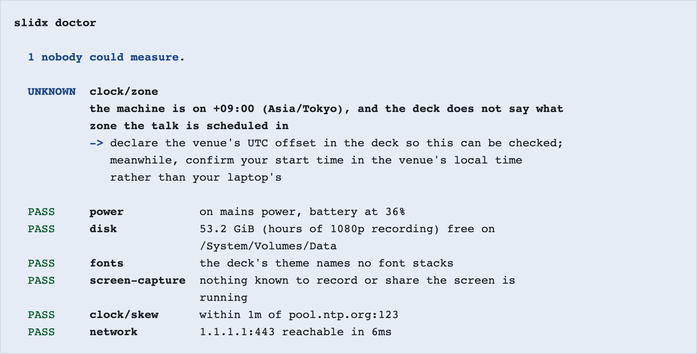

# The night before

You are speaking tomorrow. This page is indexed by symptom and each entry says
what to run and what the answer means. Nothing here explains a concept.

If you have five minutes and nothing is wrong yet, skip to
[twenty minutes before you walk on](#twenty-minutes-before-you-walk-on).

## The build will not finish

A parse never fails, so a bad line is a diagnostic and a slide that still
renders, never an error that leaves you with nothing. What does stop a build is
a **blocking** diagnostic, and the message names the rule and what to do.

If it is midnight and you have decided the rule is wrong about your deck:

```ts
export default defineConfig({ plugins: [slidx({ failOnDiagnostics: false })] });
```

That gets you a deck tonight. It also gets you the deck the rule was warning
about, so read the diagnostic before you silence it.

## The venue Wi-Fi is down

A built deck makes zero network requests. Fonts, images, styles and scripts are
inlined or bundled, and a remote asset is a build error, so a deck that built is
already a deck that does not need a network.

Prove it now rather than believing it: open `dist/slides/index.html` straight
from the filesystem with your network switched off. If it renders, tomorrow's
room cannot take it away from you.

## I do not know whether this machine is ready

```bash
slidx doctor
```

Worst first, each finding with something to do about it. It reads power, disk,
clock skew against NTP, the fonts your theme names, whether anything is
recording the screen, and whether the network you are on actually works.



That is a real report from the machine that generated this page, which is the
only kind there is — the command reads the laptop you are standing at.

`UNKNOWN` is not `PASS`. It means nothing portable can read that, and a guess
about whether Do Not Disturb is on would be worse than silence.

Run it on the machine you will actually speak from. A laptop you wrote the talk
on and a laptop you present from are two different answers.

## The text may be too small from the back

```bash
slidx lint
```

The rule is not a pixel threshold. It is the angular size a glyph subtends from
the back row, which is the only version of the question that has an answer: 24px
on a laptop and 24px on a wall three rows from the back are different sizes.

## The colours looked fine on my laptop

The same command. Contrast is checked as a WCAG ratio and then again through a
model of what a projector does to it — washout is the failure that only ever
shows up in the room, on the day, with the lights up.

If the report is bad and it is late, switch the deck to the theme that was built
for exactly this:

```yaml
theme: contrast
```

## Something is running off the edge of a slide

Overflow is measured in a real browser, because whether content fits depends on
where lines break and no build-time model knows that. If the report says
**unchecked** rather than clean, there was no browser available — those are
opposite answers and only one of them means the deck is fine.

```bash
vp exec playwright install chromium
```

## The presenter view will not open, or the projector forces mirroring

The presenter view is its own URL, not a window slidx has to be allowed to
open — `/slides/presenter/` in dev, `presenter/index.html` in the build. Press
`p` from the audience window, or open the address yourself in a second window.

Two windows stay on the same slide over a broadcast channel. Where that channel
is unavailable, mirroring is off and **the deck still presents** — you drive the
window you are looking at.

## The demo might die

If the slide declared a fallback, `d` switches between the live target and the
recording of it working. Both are already in the markup: a fallback that has to
be fetched when the demo dies is not a fallback, it is a second thing that
fails, at the same moment, for the same reason.

If your demo slide has no declared fallback and you have an hour, record it
working and declare it. If you have ten minutes, screenshot it.

## I am going to run over

The presenter view's clock runs against the slot your frontmatter declared, and
warns before the end rather than as it expires. Under it, the pace reading
compares where you are against the `budget:` you wrote per slide, so the answer
is "slide 7 took four minutes and was budgeted one" rather than "you ran over" —
which is the one form of the fact you can act on.

Mark the slides you could drop, tonight, while you can still think about it:

```yaml
optional: true
```

Only those are ever offered when you are behind. The author decides what the
talk can lose; nothing guesses.

## Keys I will want and will not remember

| Key                      | What it does                      |
| ------------------------ | --------------------------------- |
| `→` `Space` `PageDown`   | Next stop                         |
| `←` `PageUp` `Backspace` | Previous stop                     |
| `Home` / `End`           | First / last stop on this slide   |
| `o`                      | Slide overview                    |
| `p`                      | Presenter view                    |
| `b` or `.`               | Black out the screen              |
| `f`                      | Fullscreen                        |
| `t` / `r`                | Start or pause / reset the timer  |
| `d`                      | Switch the demo for its recording |
| `?`                      | Show these shortcuts              |

The navigation keys are the ones presentation remotes actually send. The letters
are the ones already in your fingers.

## Somebody is going to ask for the code

A fence marked `.share` is published as its own page inside your deck's own
output, with a QR on the slide pointing at it:

````md
```rust {#retry-policy .share title="How we back off"}
fn retry(attempt: u32) -> Duration { … }
```
````

The page carries the whole snippet rather than the part that fitted on the
slide, and it ships no script — not even a copy button, because selection is a
browser feature every phone already has and that page is the one most likely to
be opened over a hotel connection.

## I need it as a PDF

```bash
slidx export --target pdf
```

The print document — `/slides/print/` in dev — is the whole deck with each
animation stop as its own page, so the handout is not a different talk from the
one you gave. `slidx export` runs the build and packages what it wrote; nothing
re-renders, because a second renderer would mean the file you hand over could
differ from the deck you checked.

## I cannot find the deck

```bash
slidx list          # every deck this machine has seen
slidx grep "wasm"   # search them all, and get back the slide
slidx open          # fuzzy-find one, and print its path
```

`slidx grep` answers in slides rather than in file paths, because "slide 7 of
the VueConf deck" is where a speaker keeps their content and `slides/0007.md:12`
is not.

## Twenty minutes before you walk on

1. `slidx doctor` on this machine, on this network, plugged in.
2. Open the built deck from the filesystem once, with Wi-Fi off.
3. Open the presenter view in the second window and check the clock says your
   slot.
4. Press `b`. Press it again. That is the key you will want and the one you will
   forget.
5. If you have a demo, press `d` once to see the fallback, and once to come
   back.

Then close the laptop lid on the rehearsal and go. Everything above is already
decided.
